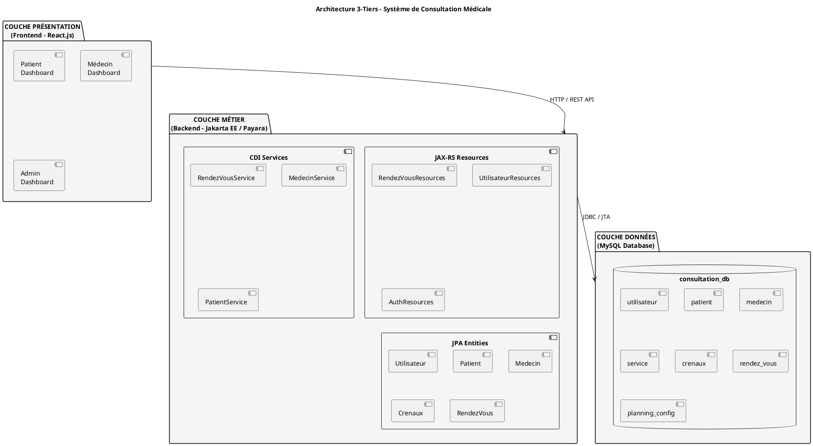
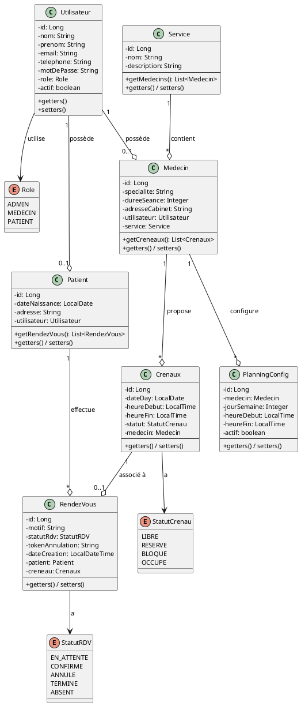
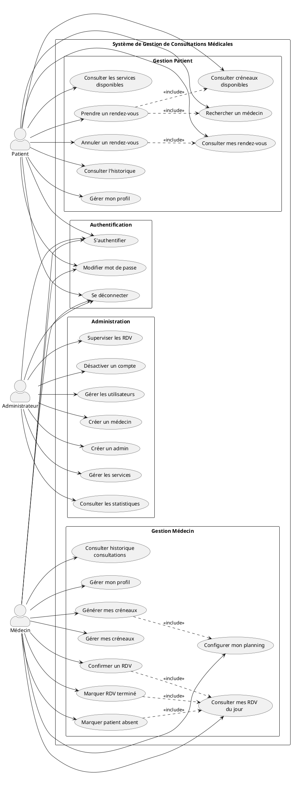
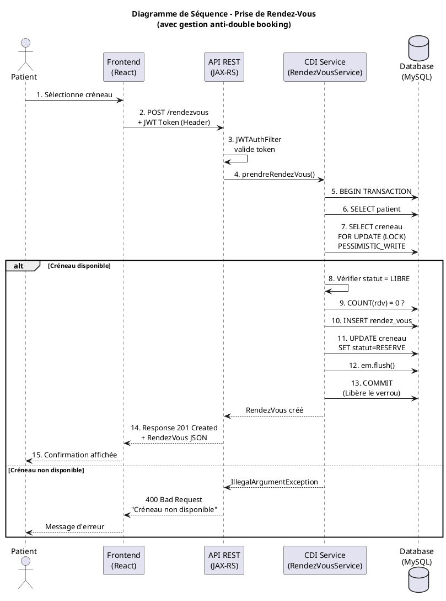
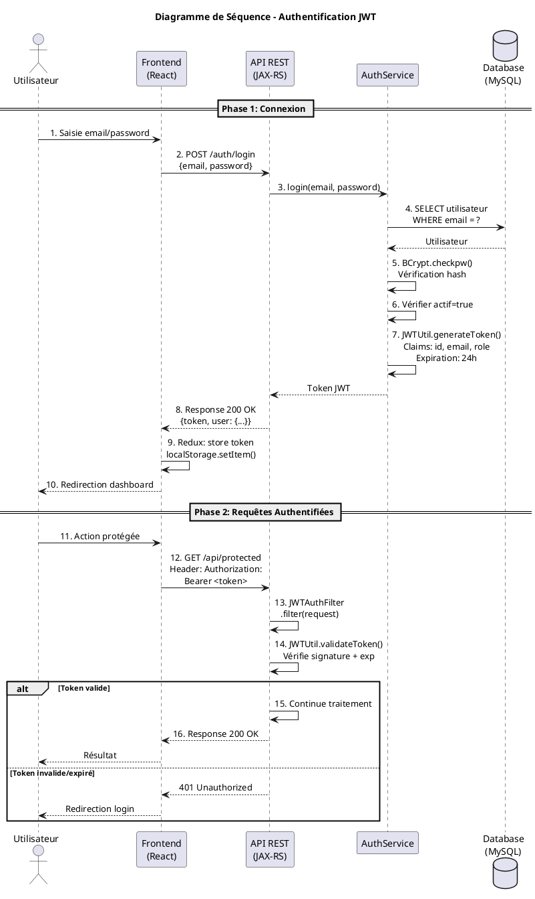
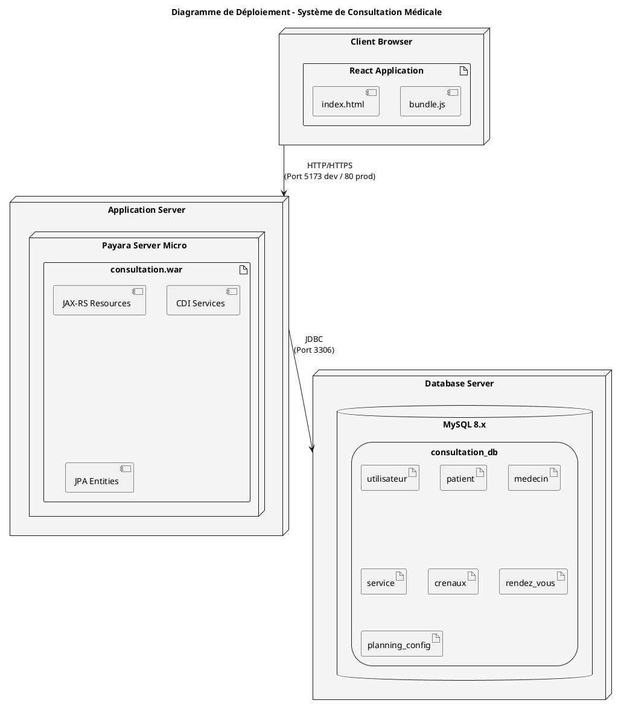
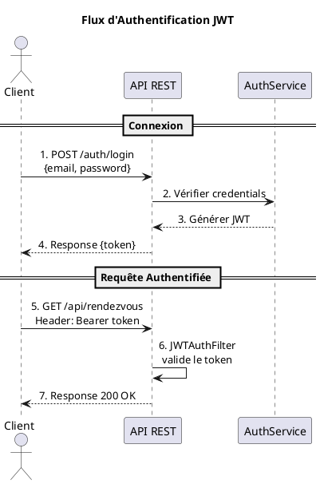

# DOCUMENTATION TECHNIQUE

## Système de Gestion des Consultations Médicales

---

**Réalisé par :** Serigne Abdoulaye BABOU - Madeleine SARR - Abdoul Aziz DIAGNE - Souleymane BARRY
**Date :** Février 2026  
**Version :** 1.0

---

## TABLE DES MATIÈRES

1. [Contexte et Objectifs du Projet](#1-contexte-et-objectifs-du-projet)
2. [Architecture Globale de la Solution](#2-architecture-globale-de-la-solution)
3. [Choix Technologiques](#3-choix-technologiques)
4. [Diagrammes UML](#4-diagrammes-uml)
5. [Gestion des Transactions et Cohérence des Données](#5-gestion-des-transactions-et-cohérence-des-données)
6. [API REST - Endpoints](#6-api-rest---endpoints)
7. [Scénarios de Test](#7-scénarios-de-test)
8. [Conclusion](#8-conclusion)

---

## 1. CONTEXTE ET OBJECTIFS DU PROJET

### 1.1 Contexte

Le secteur de la santé fait face à des défis croissants en matière de gestion des rendez-vous médicaux. Les établissements de santé ont besoin d'outils modernes permettant une gestion efficace des consultations, réduisant les temps d'attente et optimisant la planification des ressources médicales.

### 1.2 Problématique

- Difficulté de coordination entre patients, médecins et administration
- Risque de double réservation des créneaux
- Absence de visibilité en temps réel sur les disponibilités
- Gestion manuelle chronophage et source d'erreurs

### 1.3 Objectifs

| Objectif           | Description                                                          |
| ------------------ | -------------------------------------------------------------------- |
| **Centralisation** | Créer une plateforme unique de gestion des consultations             |
| **Automatisation** | Automatiser la génération des créneaux et la gestion des rendez-vous |
| **Fiabilité**      | Garantir l'intégrité des données et éviter le double booking         |
| **Accessibilité**  | Proposer une interface web moderne et responsive                     |
| **Sécurité**       | Assurer l'authentification et l'autorisation des utilisateurs        |

### 1.4 Périmètre Fonctionnel

Le système couvre les fonctionnalités suivantes :

**Pour les Patients :**

- Inscription et authentification
- Consultation des créneaux disponibles
- Prise de rendez-vous en ligne
- Visualisation et annulation de ses rendez-vous
- Consultation de l'historique

**Pour les Médecins :**

- Gestion du planning personnel
- Configuration des créneaux horaires
- Visualisation des rendez-vous du jour
- Modification du statut des consultations

**Pour les Administrateurs :**

- Gestion des utilisateurs (patients, médecins, admins)
- Gestion des services médicaux
- Tableaux de bord statistiques
- Configuration globale du système

---

## 2. ARCHITECTURE GLOBALE DE LA SOLUTION

### 2.1 Architecture 3-Tiers

Le système adopte une architecture 3-tiers classique :



### 2.2 Architecture des Composants Backend

```
com.consultation/
├── models/                    # Entités JPA
│   ├── Utilisateur.java      # Entité de base utilisateur
│   ├── Patient.java          # Entité patient (hérite de Utilisateur)
│   ├── Medecin.java          # Entité médecin (hérite de Utilisateur)
│   ├── Service.java          # Services médicaux
│   ├── Crenaux.java          # Créneaux horaires
│   ├── RendezVous.java       # Rendez-vous
│   ├── PlanningConfig.java   # Configuration planning
│   ├── Role.java             # Énumération des rôles
│   ├── StatutCrenau.java     # Énumération statuts créneaux
│   └── StatutRDV.java        # Énumération statuts RDV
│
├── services/                  # Couche métier (CDI Beans)
│   ├── RendezVousService.java
│   ├── UtilisateurService.java
│   ├── MedecinService.java
│   ├── PatientService.java
│   ├── ServiceService.java
│   ├── CrenauxService.java
│   ├── AuthService.java
│   └── PlanningConfigService.java
│
├── resources/                 # API REST (JAX-RS)
│   ├── RendezVousResources.java
│   ├── UtilisateurResources.java
│   ├── MedecinResources.java
│   ├── PatientResources.java
│   ├── ServiceResources.java
│   └── AuthResources.java
│
├── filters/                   # Filtres HTTP
│   ├── CORSFilter.java           # Gestion CORS
│   └── JWTAuthFilter.java        # Authentification JWT
│
├── security/                  # Sécurité
│   └── JWTUtil.java              # Utilitaires JWT
│
└── config/                    # Configuration
    └── ApplicationConfig.java # Configuration JAX-RS
```

### 2.3 Architecture Frontend

```
Frontend-Consultation/
├── src/
│   ├── pages/                 # Pages de l'application
│   │   ├── Admin/            # Interface administrateur
│   │   ├── Auth/             # Authentification
│   │   ├── medecin/          # Interface médecin
│   │   └── patient/          # Interface patient
│   │
│   ├── composants/           # Composants réutilisables
│   │   ├── Avatar.jsx
│   │   ├── Footer.jsx
│   │   ├── PrivateRoute.jsx
│   │   └── Sidebar.jsx
│   │
│   ├── services/             # Services API
│   │   ├── api/
│   │   │   ├── authService.js
│   │   │   ├── consultationService.js
│   │   │   └── utilisateurService.js
│   │   └── hooks/            # Custom React Hooks
│   │
│   ├── store/                # État global (Redux)
│   │   ├── index.js
│   │   └── userSlice.js
│   │
│   └── layout/               # Layouts
│       └── DefaultLayout.jsx
```

---

## 3. CHOIX TECHNOLOGIQUES

### 3.1 Technologies Backend

| Technologie       | Version | Justification                                             |
| ----------------- | ------- | --------------------------------------------------------- |
| **Jakarta EE**    | 10      | Standard d'entreprise pour les applications Java robustes |
| **Payara Server** | Micro   | Serveur d'applications léger compatible Jakarta EE        |
| **JPA/Hibernate** | 6.x     | ORM mature pour la persistance des données                |
| **JAX-RS**        | 3.1     | Standard pour créer des API REST                          |
| **CDI**           | 4.0     | Injection de dépendances et gestion des beans             |
| **JTA**           | 2.0     | Gestion des transactions (via @Transactional)             |
| **JWT**           | 0.11.5  | Authentification stateless et sécurisée                   |
| **BCrypt**        | 0.4     | Hachage sécurisé des mots de passe                        |
| **MySQL**         | 8.x     | SGBD relationnel performant et fiable                     |

### 3.2 Technologies Frontend

| Technologie      | Version | Justification                             |
| ---------------- | ------- | ----------------------------------------- |
| **React.js**     | 18.x    | Bibliothèque UI performante et populaire  |
| **Redux**        | -       | Gestion de l'état global de l'application |
| **Vite**         | -       | Build tool moderne et rapide              |
| **Tailwind CSS** | -       | Framework CSS utilitaire                  |
| **React Router** | 6.x     | Routage côté client                       |

### 3.3 Pourquoi ces choix ?

#### API REST vs SOAP

- **REST** : Plus léger, utilise HTTP nativement, JSON plus facile à manipuler
- Idéal pour les applications web modernes avec frontend JavaScript

#### CDI vs EJB

- **CDI (Contexts and Dependency Injection)** : Approche moderne et légère
- `@ApplicationScoped` : Beans partagés dans toute l'application
- `@Transactional` : Utilise JTA pour la gestion des transactions
- Plus simple et moins verbeux que les EJB classiques

#### JPA vs JDBC Direct

- **JPA** : Abstraction objet-relationnel, moins de code boilerplate
- Requêtes JPQL plus lisibles et maintenables
- Gestion automatique du cycle de vie des entités

#### JTA (Java Transaction API)

- Transactions déclaratives avec `@Transactional`
- Gestion automatique des rollbacks en cas d'erreur
- Intégration native avec CDI

#### JWT (JSON Web Token) pour la sécurité

- Authentification stateless (pas de session côté serveur)
- Token signé contenant les informations utilisateur
- Facilite la scalabilité horizontale

---

## 4. DIAGRAMMES UML

### 4.1 Diagramme de Classes



**Légende des relations :**

- **Association unidirectionnelle** : Une classe utilise une autre
- **Agrégation (◇)** : Cycle de vie indépendant
- **Composition (◆)** : Cycle de vie dépendant
- **Multiplicités** : 1 (exactement un), 0..1 (zéro ou un), \* (plusieurs)

### 4.2 Diagramme de Cas d'Utilisation



#### 4.2.1 Tableau Récapitulatif des Cas d'Utilisation

| Acteur      | Cas d'Utilisation              | Description                                             |
| ----------- | ------------------------------ | ------------------------------------------------------- |
| **Tous**    | S'authentifier                 | Connexion avec email/mot de passe, génération token JWT |
| **Tous**    | Se déconnecter                 | Invalidation de la session côté client                  |
| **Tous**    | Modifier mot de passe          | Changement du mot de passe utilisateur                  |
| **Patient** | Consulter services disponibles | Visualiser la liste des services médicaux               |
| **Patient** | Rechercher un médecin          | Filtrer les médecins par service, nom ou spécialité     |
| **Patient** | Consulter créneaux disponibles | Voir les créneaux libres d'un médecin                   |
| **Patient** | Prendre un rendez-vous         | Réserver un créneau avec motif de consultation          |
| **Patient** | Consulter mes rendez-vous      | Voir la liste de ses RDV (à venir et passés)            |
| **Patient** | Annuler un rendez-vous         | Annuler un RDV en attente ou confirmé                   |
| **Patient** | Consulter l'historique         | Voir l'historique des consultations passées             |
| **Patient** | Gérer mon profil               | Modifier informations personnelles                      |
| **Médecin** | Configurer mon planning        | Définir les horaires de travail hebdomadaires           |
| **Médecin** | Générer mes créneaux           | Créer automatiquement les créneaux selon le planning    |
| **Médecin** | Gérer mes créneaux             | Bloquer/débloquer des créneaux spécifiques              |
| **Médecin** | Consulter RDV du jour          | Voir les rendez-vous planifiés pour aujourd'hui         |
| **Médecin** | Confirmer un RDV               | Valider un rendez-vous en attente                       |
| **Médecin** | Marquer RDV terminé            | Indiquer qu'une consultation est terminée               |
| **Médecin** | Marquer patient absent         | Signaler l'absence d'un patient                         |
| **Médecin** | Consulter historique           | Voir l'historique de ses consultations                  |
| **Médecin** | Gérer mon profil               | Modifier informations professionnelles                  |
| **Admin**   | Gérer les utilisateurs         | CRUD sur tous les utilisateurs du système               |
| **Admin**   | Créer un médecin               | Enregistrer un nouveau médecin avec son service         |
| **Admin**   | Créer un admin                 | Créer un compte administrateur                          |
| **Admin**   | Gérer les services             | CRUD sur les services médicaux                          |
| **Admin**   | Consulter les statistiques     | Voir le dashboard avec métriques                        |
| **Admin**   | Superviser les RDV             | Consulter tous les rendez-vous du système               |
| **Admin**   | Désactiver un compte           | Désactiver un utilisateur sans le supprimer             |

### 4.3 Diagramme de Séquence - Prise de Rendez-Vous



### 4.4 Diagramme de Séquence - Authentification JWT



### 4.5 Diagramme de Déploiement



---

## 5. GESTION DES TRANSACTIONS ET COHÉRENCE DES DONNÉES

### 5.1 Configuration JTA

Le système utilise **JTA (Java Transaction API)** pour la gestion des transactions, configuré dans `persistence.xml` :

```xml
<persistence-unit name="consultationPU" transaction-type="JTA">
    <jta-data-source>jdbc/consultationDb</jta-data-source>
    <properties>
        <property name="hibernate.dialect" value="org.hibernate.dialect.MySQL8Dialect"/>
        <property name="hibernate.hbm2ddl.auto" value="update"/>
    </properties>
</persistence-unit>
```

### 5.2 Gestion Transactionnelle avec CDI

Les services métier utilisent l'annotation `@Transactional` (CDI) qui s'appuie sur JTA :

```java
@ApplicationScoped
public class RendezVousService {

    @Transactional
    public RendezVous prendreRendezVous(Long patientId, Long creneauId, String motif) {
        // Transaction automatiquement gérée par JTA
        // Rollback automatique en cas d'exception RuntimeException
    }
}
```

**Comportement de @Transactional :**

| Aspect      | Comportement                                                  |
| ----------- | ------------------------------------------------------------- |
| Démarrage   | Transaction démarrée automatiquement à l'entrée de la méthode |
| Commit      | Automatique si la méthode se termine normalement              |
| Rollback    | Automatique si une RuntimeException est levée                 |
| Propagation | Par défaut REQUIRED (utilise ou crée une transaction)         |

### 5.3 Prévention du Double Booking

Le système implémente un mécanisme robuste pour éviter qu'un même créneau soit réservé simultanément par plusieurs utilisateurs :

#### 5.3.1 Verrouillage Pessimiste

```java
@Transactional
public RendezVous prendreRendezVous(Long patientId, Long creneauId, String motif) {
    // 1. Acquérir un verrou exclusif sur le créneau
    Crenaux creneau;
    try {
        creneau = em.find(Crenaux.class, creneauId, LockModeType.PESSIMISTIC_WRITE);
    } catch (PessimisticLockException | LockTimeoutException e) {
        throw new IllegalStateException("Créneau en cours de réservation. Réessayez.");
    }

    // 2. Vérifier la disponibilité APRÈS acquisition du verrou
    if (creneau.getStatut() != StatutCrenau.LIBRE) {
        throw new IllegalArgumentException("Ce créneau n'est plus disponible");
    }

    // 3. Double vérification via requête
    Long existingRdv = em.createQuery(
        "SELECT COUNT(r) FROM RendezVous r WHERE r.creneau.id = :creneauId", Long.class)
        .setParameter("creneauId", creneauId)
        .getSingleResult();

    if (existingRdv > 0) {
        throw new IllegalArgumentException("Ce créneau est déjà réservé");
    }

    // 4. Créer le rendez-vous et mettre à jour le créneau
    RendezVous rdv = new RendezVous();
    rdv.setPatient(patient);
    rdv.setCreneau(creneau);
    rdv.setStatutRdv(StatutRDV.CONFIRME);

    creneau.setStatut(StatutCrenau.RESERVE);

    em.persist(rdv);
    em.merge(creneau);
    em.flush(); // Force l'écriture pour détecter les violations

    return rdv;
}
```

#### 5.3.2 Contraintes de Base de Données

```sql
-- Contrainte d'unicité sur la relation créneau-rendez-vous
ALTER TABLE rendez_vous
ADD CONSTRAINT uk_creneau UNIQUE (id_creneau);
```

#### 5.3.3 Diagramme de l'algorithme anti-double booking


### 5.4 Gestion des Erreurs et Rollback

```java
@POST
public Response prendreRendezVous(Map<String, Object> body) {
    try {
        RendezVous rdv = rendezVousService.prendreRendezVous(patientId, creneauId, motif);
        return Response.status(Status.CREATED).entity(response).build();

    } catch (IllegalStateException e) {
        // Conflit de concurrence → 409 CONFLICT
        return Response.status(Status.CONFLICT)
            .entity(Map.of("error", e.getMessage(), "code", "CONFLICT"))
            .build();

    } catch (IllegalArgumentException e) {
        // Données invalides → 400 BAD_REQUEST
        return Response.status(Status.BAD_REQUEST)
            .entity(Map.of("error", e.getMessage(), "code", "BAD_REQUEST"))
            .build();

    } catch (PersistenceException e) {
        // Violation contrainte DB → 409 CONFLICT
        return Response.status(Status.CONFLICT)
            .entity(Map.of("error", "Créneau déjà réservé", "code", "CONFLICT"))
            .build();
    }
}
```

---

## 6. API REST - ENDPOINTS

### 6.1 Authentification

| Méthode | Endpoint             | Description           |
| ------- | -------------------- | --------------------- |
| POST    | `/api/auth/login`    | Connexion utilisateur |
| POST    | `/api/auth/register` | Inscription patient   |

### 6.2 Rendez-vous

| Méthode | Endpoint                       | Description         |
| ------- | ------------------------------ | ------------------- |
| GET     | `/api/rendezvous`              | Liste tous les RDV  |
| GET     | `/api/rendezvous/patient/{id}` | RDV d'un patient    |
| GET     | `/api/rendezvous/medecin/{id}` | RDV d'un médecin    |
| POST    | `/api/rendezvous`              | Créer un RDV        |
| PUT     | `/api/rendezvous/{id}/statut`  | Modifier statut RDV |
| DELETE  | `/api/rendezvous/{id}`         | Annuler un RDV      |

### 6.3 Créneaux

| Méthode | Endpoint                     | Description             |
| ------- | ---------------------------- | ----------------------- |
| GET     | `/api/creneaux/medecin/{id}` | Créneaux d'un médecin   |
| GET     | `/api/creneaux/disponibles`  | Créneaux libres         |
| POST    | `/api/creneaux/generer`      | Générer des créneaux    |
| PUT     | `/api/creneaux/{id}/statut`  | Modifier statut créneau |

### 6.4 Utilisateurs

| Méthode | Endpoint                 | Description           |
| ------- | ------------------------ | --------------------- |
| GET     | `/api/utilisateurs`      | Liste utilisateurs    |
| GET     | `/api/utilisateurs/{id}` | Détail utilisateur    |
| POST    | `/api/utilisateurs`      | Créer utilisateur     |
| PUT     | `/api/utilisateurs/{id}` | Modifier utilisateur  |
| DELETE  | `/api/utilisateurs/{id}` | Supprimer utilisateur |

### 6.5 Services Médicaux

| Méthode | Endpoint             | Description       |
| ------- | -------------------- | ----------------- |
| GET     | `/api/services`      | Liste services    |
| POST    | `/api/services`      | Créer service     |
| PUT     | `/api/services/{id}` | Modifier service  |
| DELETE  | `/api/services/{id}` | Supprimer service |

---

## 6.6 SÉCURITÉ - AUTHENTIFICATION JWT

### 6.6.1 Principe de fonctionnement

Le système utilise **JWT (JSON Web Token)** pour l'authentification :



### 6.6.2 Structure du Token JWT

```json
{
  "header": {
    "alg": "HS256",
    "typ": "JWT"
  },
  "payload": {
    "sub": "patient@email.com",
    "role": "PATIENT",
    "iat": 1708300800,
    "exp": 1708387200
  },
  "signature": "..."
}
```

### 6.6.3 Filtre d'Authentification (JWTAuthFilter.java)

```java
@Provider
@Priority(Priorities.AUTHENTICATION)
public class JWTAuthFilter implements ContainerRequestFilter {

    @Override
    public void filter(ContainerRequestContext requestContext) {
        String path = requestContext.getUriInfo().getPath();

        // Endpoints publics - pas de vérification
        if (isPublicEndpoint(path)) {
            return;
        }

        // Récupérer et valider le token
        String authHeader = requestContext.getHeaderString("Authorization");
        if (authHeader == null || !authHeader.startsWith("Bearer ")) {
            abortWithUnauthorized(requestContext, "Token manquant");
            return;
        }

        String token = authHeader.substring(7);
        try {
            Claims claims = Jwts.parserBuilder()
                .setSigningKey(getSigningKey())
                .build()
                .parseClaimsJws(token)
                .getBody();

            // Ajouter les infos utilisateur au contexte
            requestContext.setProperty("userEmail", claims.getSubject());
            requestContext.setProperty("userRole", claims.get("role"));

        } catch (ExpiredJwtException e) {
            abortWithUnauthorized(requestContext, "Token expiré");
        } catch (Exception e) {
            abortWithUnauthorized(requestContext, "Token invalide");
        }
    }
}
```

### 6.6.4 Endpoints Publics vs Protégés

| Type        | Endpoints                                 | Authentification    |
| ----------- | ----------------------------------------- | ------------------- |
| **Public**  | `POST /auth/login`, `POST /auth/register` | ❌ Non requise      |
| **Public**  | `GET /services`                           | ❌ Non requise      |
| **Protégé** | `GET /rendezvous/*`                       | ✅ Token JWT requis |
| **Protégé** | `POST /rendezvous`                        | ✅ Token JWT requis |
| **Protégé** | `GET/PUT/DELETE /utilisateurs/*`          | ✅ Token JWT requis |

### 6.6.5 Sécurité des Mots de Passe

Les mots de passe sont hachés avec **BCrypt** avant stockage :

```java
// Inscription - hachage du mot de passe
String hash = BCrypt.hashpw(motDePasse, BCrypt.gensalt());
user.setMotDePasse(hash);

// Connexion - vérification
if (!BCrypt.checkpw(motDePasse, user.getMotDePasse())) {
    throw new SecurityException("Mot de passe incorrect");
}
```

---

## 7. SCÉNARIOS DE TEST

### 7.1 Tests Fonctionnels

#### Test 1 : Prise de rendez-vous réussie

| Étape | Action                   | Résultat attendu         |
| ----- | ------------------------ | ------------------------ |
| 1     | Patient se connecte      | Redirection dashboard    |
| 2     | Sélectionne un médecin   | Liste créneaux affichée  |
| 3     | Choisit un créneau LIBRE | Formulaire motif affiché |
| 4     | Valide la réservation    | Message succès, RDV créé |
| 5     | Vérification BDD         | Créneau statut=RESERVE   |

#### Test 2 : Tentative de double booking

| Étape | Action                             | Résultat attendu            |
| ----- | ---------------------------------- | --------------------------- |
| 1     | Patient A sélectionne créneau      | Créneau affiché comme libre |
| 2     | Patient B sélectionne même créneau | Créneau affiché comme libre |
| 3     | Patient A valide premier           | Succès, RDV créé            |
| 4     | Patient B valide juste après       | Erreur 409 "Non disponible" |
| 5     | Vérification BDD                   | 1 seul RDV pour ce créneau  |

### 7.2 Tests de Charge (Stress Test)

```bash
#!/bin/bash
# stress_test_booking.sh

CRENEAU_ID=5
URL="http://localhost:8080/api/rendezvous"

echo "Lancement de 10 requêtes concurrentes..."

for i in {1..10}; do
  curl -s -X POST "$URL" \
    -H "Content-Type: application/json" \
    -d "{\"patientId\": $i, \"creneauId\": $CRENEAU_ID, \"motif\": \"Test $i\"}" &
done

wait
echo "Test terminé - Vérifiez qu'un seul RDV existe"
```

**Résultats attendus :**

- 1 requête → 201 CREATED
- 9 requêtes → 409 CONFLICT ou 400 BAD_REQUEST
- 1 seul enregistrement en base

### 7.3 Tests de Sécurité

| Test               | Description              | Résultat attendu        |
| ------------------ | ------------------------ | ----------------------- |
| Injection SQL      | Tentative via paramètres | Requête sanitisée (JPA) |
| Accès non autorisé | Requête sans token       | 401 Unauthorized        |
| CORS invalide      | Origine non autorisée    | Requête bloquée         |

### 7.4 Tests d'Erreur Simulés

#### Scénario : Panne base de données pendant transaction

| Étape | Simulation           | Comportement attendu |
| ----- | -------------------- | -------------------- |
| 1     | Début réservation    | Transaction démarrée |
| 2     | Coupure connexion DB | PersistenceException |
| 3     | Reprise connexion    | Rollback automatique |
| 4     | Nouvelle tentative   | Succès               |

#### Scénario : Timeout de verrouillage

```java
// Configuration timeout dans persistence.xml
<property name="jakarta.persistence.lock.timeout" value="5000"/>
```

| Étape | Simulation              | Comportement attendu  |
| ----- | ----------------------- | --------------------- |
| 1     | Process A acquiert lock | Lock obtenu           |
| 2     | Process B tente lock    | Attente...            |
| 3     | 5 secondes passent      | LockTimeoutException  |
| 4     | Process B               | Retourne 409 CONFLICT |

### 7.5 Matrice de Tests

| Fonctionnalité      | Test Unitaire | Test Intégration | Test E2E |
| ------------------- | ------------- | ---------------- | -------- |
| Authentification    | ✅            | ✅               | ✅       |
| Prise RDV           | ✅            | ✅               | ✅       |
| Anti-double booking | ✅            | ✅               | ✅       |
| Annulation RDV      | ✅            | ✅               | ✅       |
| Gestion créneaux    | ✅            | ✅               | ✅       |
| CRUD Utilisateurs   | ✅            | ✅               | ✅       |

---

## 8. CONCLUSION

### 8.1 Objectifs Atteints

✅ Architecture 3-tiers robuste et maintenable  
✅ API REST conforme aux standards  
✅ Gestion transactionnelle avec JTA/EJB  
✅ Mécanisme anti-double booking fiable  
✅ Interface utilisateur moderne et responsive  
✅ Séparation des préoccupations (SoC)

### 8.2 Points Forts du Système

1. **Fiabilité** : Verrouillage pessimiste garantissant l'intégrité des données
2. **Scalabilité** : Architecture stateless permettant la montée en charge
3. **Maintenabilité** : Code structuré et documenté
4. **Sécurité** : Authentification, autorisation et protection CORS

### 8.3 Évolutions Possibles

- Notifications par email/SMS
- Rappels automatiques de rendez-vous
- Intégration calendrier externe (Google, Outlook)
- Application mobile native
- Téléconsultation vidéo

---

## ANNEXES

### A. Script de Création de la Base de Données

```sql
CREATE DATABASE IF NOT EXISTS consultation_db;
USE consultation_db;

CREATE TABLE utilisateur (
    id BIGINT AUTO_INCREMENT PRIMARY KEY,
    nom VARCHAR(50) NOT NULL,
    prenom VARCHAR(50) NOT NULL,
    email VARCHAR(100) NOT NULL UNIQUE,
    telephone VARCHAR(20) UNIQUE,
    mot_de_passe VARCHAR(255) NOT NULL,
    role ENUM('ADMIN', 'MEDECIN', 'PATIENT') NOT NULL,
    actif BOOLEAN DEFAULT TRUE
);

CREATE TABLE service (
    id BIGINT AUTO_INCREMENT PRIMARY KEY,
    nom VARCHAR(100) NOT NULL,
    description TEXT
);

CREATE TABLE patient (
    id_utilisateur BIGINT PRIMARY KEY,
    date_naissance DATE,
    adresse VARCHAR(255),
    FOREIGN KEY (id_utilisateur) REFERENCES utilisateur(id) ON DELETE CASCADE
);

CREATE TABLE medecin (
    id_utilisateur BIGINT PRIMARY KEY,
    specialite VARCHAR(100) NOT NULL,
    duree_seance INT,
    adresse_cabinet VARCHAR(255),
    id_service BIGINT,
    FOREIGN KEY (id_utilisateur) REFERENCES utilisateur(id) ON DELETE CASCADE,
    FOREIGN KEY (id_service) REFERENCES service(id)
);

CREATE TABLE crenaux (
    id BIGINT AUTO_INCREMENT PRIMARY KEY,
    id_medecin BIGINT NOT NULL,
    date_day DATE NOT NULL,
    heure_debut TIME NOT NULL,
    heure_fin TIME NOT NULL,
    statut ENUM('LIBRE', 'RESERVE', 'BLOQUE', 'OCCUPE') DEFAULT 'LIBRE',
    FOREIGN KEY (id_medecin) REFERENCES medecin(id_utilisateur) ON DELETE CASCADE
);

CREATE TABLE rendez_vous (
    id BIGINT AUTO_INCREMENT PRIMARY KEY,
    id_creneau BIGINT NOT NULL UNIQUE,
    id_patient BIGINT NOT NULL,
    motif TEXT,
    statut_rdv ENUM('EN_ATTENTE', 'CONFIRME', 'ANNULE', 'TERMINE', 'ABSENT') NOT NULL,
    token_annulation CHAR(36) NOT NULL UNIQUE,
    date_creation DATETIME NOT NULL DEFAULT CURRENT_TIMESTAMP,
    FOREIGN KEY (id_creneau) REFERENCES crenaux(id),
    FOREIGN KEY (id_patient) REFERENCES patient(id_utilisateur)
);
```

### B. Configuration CORS (CORSFilter.java)

```java
@Provider
@PreMatching
public class CORSFilter implements ContainerRequestFilter, ContainerResponseFilter {

    @Override
    public void filter(ContainerRequestContext requestContext) throws IOException {
        if ("OPTIONS".equalsIgnoreCase(requestContext.getMethod())) {
            requestContext.abortWith(Response.ok().build());
        }
    }

    @Override
    public void filter(ContainerRequestContext req, ContainerResponseContext res) {
        res.getHeaders().add("Access-Control-Allow-Origin", "http://localhost:5173");
        res.getHeaders().add("Access-Control-Allow-Methods", "GET, POST, PUT, DELETE, OPTIONS");
        res.getHeaders().add("Access-Control-Allow-Headers", "Content-Type, Authorization");
        res.getHeaders().add("Access-Control-Allow-Credentials", "true");
    }
}
```

---

**Document généré le :** Février 2026  
**Auteur :** Serigne Abdoulaye BABOU - Madeleine SARR - Abdoul Aziz DIAGNE - Souleymane BARRY  
**Projet :** Système de Gestion des Consultations Médicales
